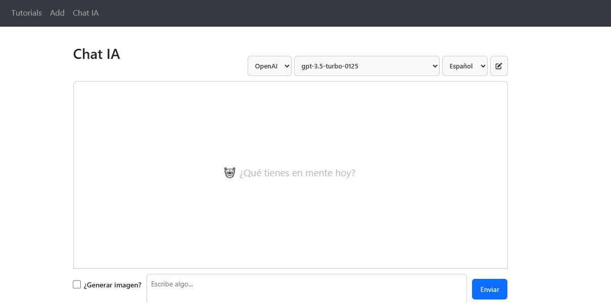
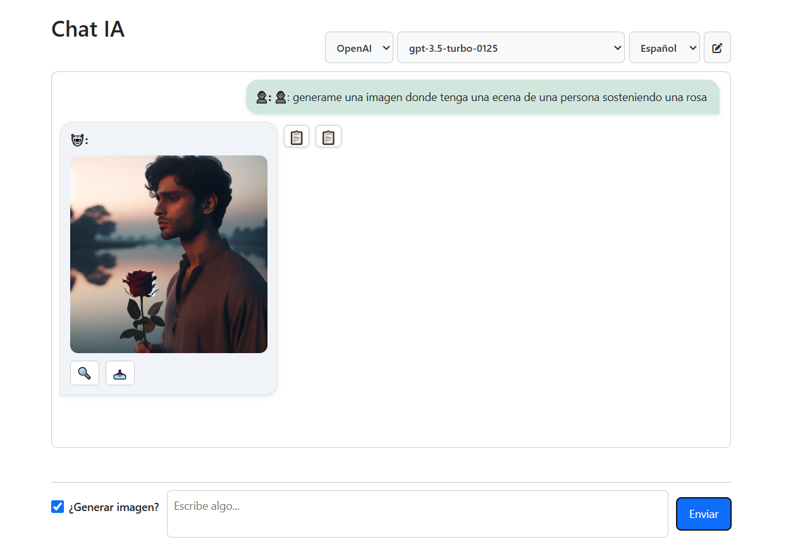
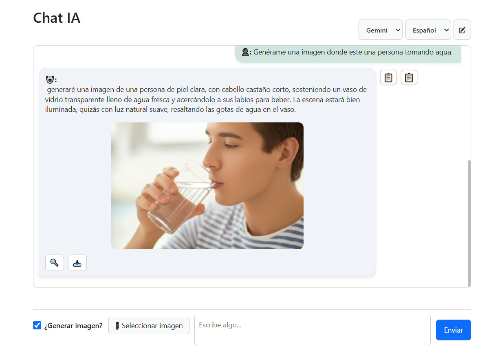

# 🧠 IA Assistant App

Aplicación completa que integra un asistente de inteligencia artificial con generación de texto e imágenes, utilizando:

- 🎨 **Angular 17** (Frontend)
- 🔧 **ASP.NET Core 9.0** (Backend)
- 📦 **Docker & Docker Compose**
- 📜 **Swagger** para documentación de API

---

## 📁 Estructura del Proyecto

IA-ASSISTANT-APP/
├── ia-assistant-ui/ # Angular 17 frontend
└── OpenAiApiDemo/ # ASP.NET Core 9 backend


---

## 🚀 Cómo ejecutar localmente

### Requisitos

- Node.js 20+
- .NET SDK 9.0+
- Docker

### 1. Clonar el repositorio

```bash
git clone https://github.com/DanielVega-SmII94/ia-assistant-app.git
cd ia-assistant-app

BACKEND
cd OpenAiApiDemo
dotnet run
Swagger disponible


FRONTEND
cd ia-assistant-ui
npm install
ng serve

docker-compose up --build


✨ Funcionalidades
- Soporte para modelos OpenAI y Gemini
- Generación de texto e imágenes
- Visualización de historial
- Copiar HTML y Markdown
- Previsualización y descarga de imágenes
- Interfaz con scroll automático, checkbox y selectores de idioma/modelo

## 📸 Capturas del sistema

### 💬 Interfaz de chatbot:


### 🛠️ Herramientas de Generación 
- Seleccionar modelos y tipo de ia, hasta idioma:


### 🤖🧠 Generación de imagenes por medio de OPENAI:


### 🤖🪐 Generación de imagenes por medio de GEMINI:



